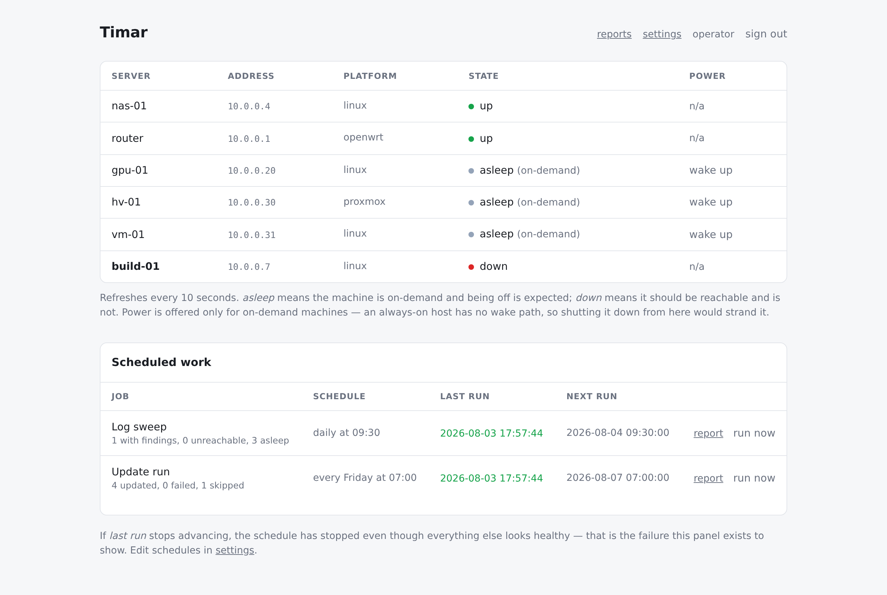

# Timar

[](https://github.com/orkun-soylu/timar/actions/workflows/tests.yml)
[](LICENSE)

Agentless fleet care for homelabs — wake machines that are asleep, update them, read their
logs, and put them back the way they were found.

Nothing is installed on the machines you manage. Timar needs SSH and, for hosts that sleep,
Wake-on-LAN. It ships as a single container with a single data volume, so the whole
installation moves by copying a directory.

<picture>
  <source media="(prefers-color-scheme: dark)" srcset="docs/images/dashboard-dark.png">
  
</picture>

Three states, not two: *asleep* is a machine that is **meant** to be off, and it is not painted
like a fault — a status page that shows both in red teaches you to ignore red. There is a
one-page tour at **[timar.tools](https://timar.tools)**.

> **Status: early.** The engine (wake / update / log sweep / platform command sets), the
> scheduler, settings and key enrolment work and are tested. See
> [ARCHITECTURE.md](ARCHITECTURE.md).

## Run it

```bash
curl -O https://raw.githubusercontent.com/orkun-soylu/timar/main/docker-compose.yml
docker compose up -d
```

Then open `http://<host>:8080` and create the operator account. Nothing else answers until you
do — the first screen is the only one served before an account exists.

The image is published for **amd64 and arm64** — a Raspberry Pi is a first-class host here, not
an afterthought. `:latest` follows the most recent release; pin a version
(`ghcr.io/orkun-soylu/timar:0.1.0`) if you would rather choose when to move.

Configuration lives in the `timar-data` volume as `config.yaml`; see
[`config.example.yaml`](config.example.yaml) for the fields.

> ⚠️ **Do not expose this to the internet.** Timar holds an SSH key that reaches every machine
> it manages and can grant itself `sudo` on them. The login page is the only thing in front of
> your fleet. Keep it on a private network, or behind a reverse proxy you control.

### Running on a bridge network

The default compose file uses `network_mode: host` because **Wake-on-LAN does not work from a
bridge network** — a magic packet is a broadcast, and from a bridge the send succeeds with no
error while the packet never reaches the LAN. Measured with `tcpdump` on the LAN interface:
bridge network 0 packets, host network 1 packet.

Everything else works fine on a bridge. If you do not need to wake machines, replace the
`network_mode: host` line with:

```yaml
    ports:
      - "8080:8080"
```

To wake machines from a bridge deployment, set a **wake relay** on those servers: another
configured host, already enrolled and always on, that sends the packet on Timar's behalf over
SSH. It needs `python3` or `wakeonlan`.

A relay is also the only way to wake a machine in a **different subnet** — a second site over a
tunnel, an office network. Host networking cannot help there, because the packet has to
originate on the target's own segment.

## Why

Homelab machines are mostly *off*. The tools built for always-on fleets assume an agent that can
phone home, which is the one thing a sleeping machine cannot do. Timar inverts it: waking the
host is step one of the job, and shutting it back down is the last.

## What it does

- **Update** — wake if asleep, run the platform's update command, shut down again if it started
  off. Proxmox hosts orchestrate their guests: start, update, shut down, in order.
- **Power, from the dashboard** — each on-demand machine's row offers the action that fits its
  state: wake one that is asleep, shut down one that is up. Guests are started and stopped
  through their hypervisor with `qm`, since a VM has no wake address of its own. Always-on
  machines are offered nothing: Timar will not shut down a machine it cannot wake again.
- **Log sweep** — system log errors, disk pressure, stopped containers, and scheduled jobs that
  did not run.
- **Platform-aware** — Linux/systemd, OpenWrt and Proxmox VE each get commands that exist on
  them. A check that cannot run says so instead of quietly reporting all-clear.
- **Report archive** — every run a job finishes is kept and browsable under `/reports`, filtered
  by job. Telegram delivery is a copy of that, not the only place the findings exist; a disk
  creeping upwards or an update that fails every week is visible as a series, not one snapshot.

## Supported platforms

| | System log | Disk | Containers | Unattended updates |
|---|---|---|---|---|
| Linux (systemd) | `journalctl` | ✅ | Docker | ✅ |
| Proxmox VE | `journalctl` | ✅ | — (guests via `qm`) | ✅ |
| OpenWrt | `logread` | ✅ | — | off by default — see below |

OpenWrt has no default update command on purpose. An unattended `apk upgrade` on a router can
fill the overlay partition or land a kernel-module mismatch, and the machine that breaks is the
one carrying the SSH session you would repair it from. Set `update_cmd` yourself if you want it.

## Development

```bash
python3 -m venv .venv && .venv/bin/pip install -e '.[dev]'
.venv/bin/python -m pytest
```

Run it against a throwaway installation rather than your real one — `TIMAR_DATA` is the whole
installation, so pointing it somewhere disposable means you cannot damage a live fleet:

```bash
TIMAR_DATA=/tmp/timar-dev TIMAR_PORT=8099 .venv/bin/python -m timar.web
```

## Contributing

Contributions are welcome — see [CONTRIBUTING.md](CONTRIBUTING.md). It covers one habit worth
knowing about up front: **for anything that touches a machine, a network or a page, verify it by
running it and put the measurement in the pull request.** Timar's failures are the quiet kind —
a magic packet that never leaves the host, a disk check that exits non-zero and reports
all-clear — and a passing test does not always mean the thing works.

Commits must be signed off under the [DCO](DCO) (`git commit -s`). There is no CLA.

Notable changes are recorded in [CHANGELOG.md](CHANGELOG.md); the design decisions and the
pitfalls behind them are in [ARCHITECTURE.md](ARCHITECTURE.md).

## License

[MIT](LICENSE) © 2026 Orkun Soylu

Third-party components, including the vendored copy of htmx, are listed in
[THIRD-PARTY-NOTICES.md](THIRD-PARTY-NOTICES.md).
