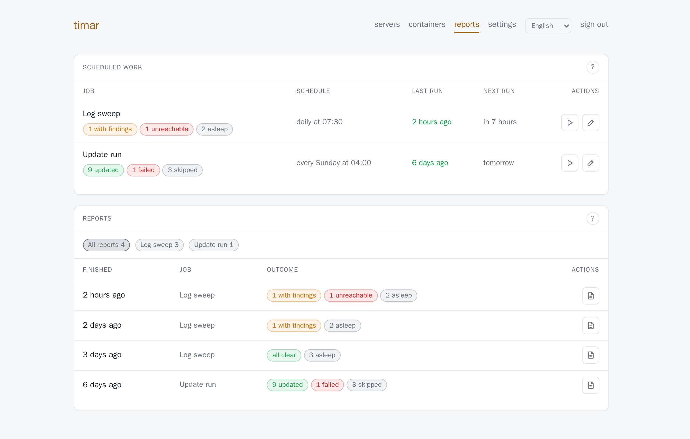
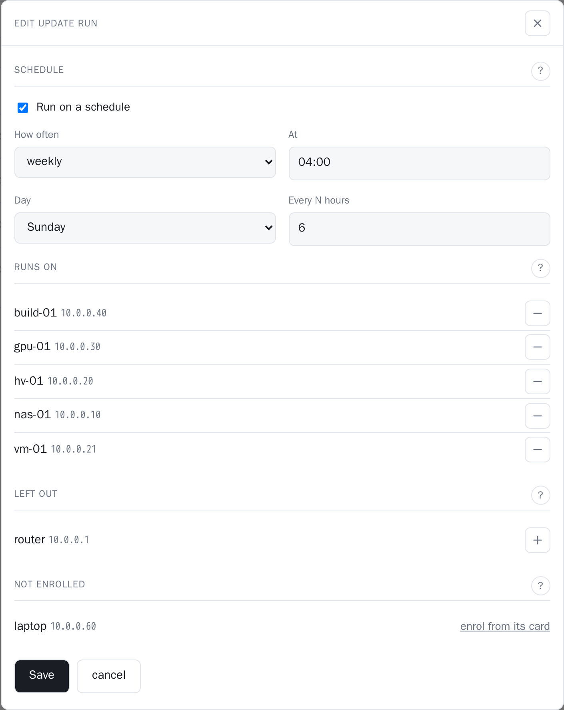
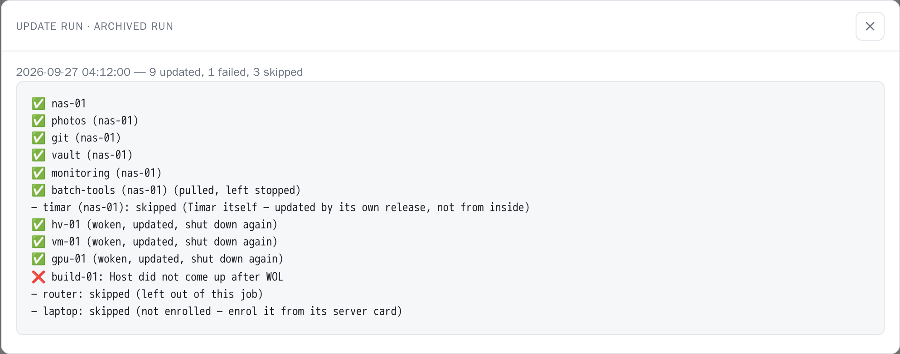
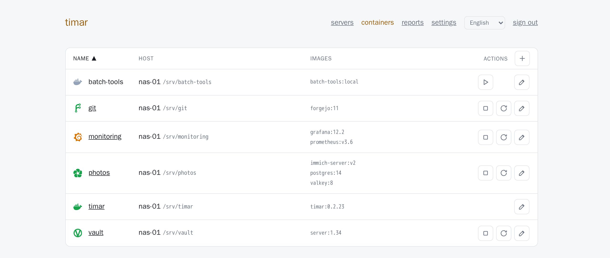

# timar

[](https://github.com/orkun-soylu/timar/actions/workflows/tests.yml)
[](LICENSE)

Agentless fleet care for homelabs: wake machines that are asleep, update them, read their logs,
and put them back the way they were found.

Nothing is installed on the machines you manage — timar needs SSH, and Wake-on-LAN for the ones
that sleep. It is one container with one data volume, so moving it is copying a directory.
There is a one-page tour at **[timar.tools](https://timar.tools)**.

<picture>
  <source media="(prefers-color-scheme: dark)" srcset="docs/images/dashboard-dark.png">
  
</picture>

Three states, not two. *Asleep* (grey) is a machine that is **meant** to be off, and it is not
painted like a fault — a status page that shows both in red teaches you to ignore red.

> **Status: early.** Wake, update, log sweep, containers, the scheduler and key enrolment work
> and are tested. Read [CHANGELOG.md](CHANGELOG.md) before upgrading.

## Run it

```bash
curl -O https://raw.githubusercontent.com/orkun-soylu/timar/main/docker-compose.yml
docker compose up -d
```

Open `http://<host>:8080` and create the operator account — nothing else answers until you do.

The image is built for **amd64 and arm64**; a Raspberry Pi is a first-class host. `:latest`
follows the newest release; pin a version (`ghcr.io/orkun-soylu/timar:0.2.26`) to choose when
you move.

Add, edit and remove servers and containers from their pages. A server's form has three
sections — *Server info*, *Update*, *SSH access* — each with a **?** that explains it; the SSH
section is also where the server is enrolled: timar installs its own key with your password once
(never stored) and proves the key works on its own. An address may carry an SSH port
(`10.0.0.5:2222`), and a *web interface* turns the server's name into a link while it is up —
a panel, or a program on your own machine through a scheme you allow ([below](#links-to-programs)).
It all lands in `config.yaml` in the `timar-data` volume, which you can also edit by hand — see
[`config.example.yaml`](config.example.yaml).

<picture>
  <source media="(prefers-color-scheme: dark)" srcset="docs/images/server-dialog-dark.png">
  
</picture>

A VM has no wake address of its own, so it names the hypervisor that starts it and inherits
*on-demand* from it — otherwise every night it spends off would be reported as an outage.

> ⚠️ **Do not expose this to the internet.** timar holds an SSH key that reaches every machine
> it manages and can grant itself `sudo` on them. Keep it on a private network, or behind a
> reverse proxy you control.

### Bridge networks and other subnets

The compose file uses `network_mode: host` because **Wake-on-LAN does not work from a bridge
network**: the send succeeds, no error, and the packet never reaches the LAN (measured with
`tcpdump`: bridge 0 packets, host 1).

If you do not need to wake machines, a bridge is fine — replace `network_mode: host` with:

```yaml
    ports:
      - "8080:8080"
```

To wake from a bridge — or to wake a machine in a **different subnet**, which host networking
cannot do either — give that server a **wake relay** (below).

### Advanced wake settings

Two settings are written in `config.yaml` by hand; the server form does not show them as fields.
It says when one is set, and saving the form keeps it untouched. Most installations need
neither: with host networking, one LAN and every machine on it, the defaults wake everything.

| Key | Default | Set it when |
|---|---|---|
| `wol_relay` | none — timar sends the packet itself | the machine is in another subnet (a second site, an office VLAN), or timar runs on a bridge network |
| `wol_broadcast` | `255.255.255.255` | timar's host has several networks and the packet leaves through the wrong one |

**`wol_relay`** names another server in the same file. A magic packet is a broadcast, and a
broadcast stops at the router, so the packet has to start inside the target's own subnet: timar
connects to the relay over SSH and sends it from there. The relay must be **always on**,
**already enrolled**, and have `python3` or `wakeonlan`. If the relay is renamed in the form,
the reference follows. If it is removed, the wake fails and says the relay "is not configured";
it doesn't fail silently.

**`wol_broadcast`** is the address the packet is sent to. `255.255.255.255` leaves through the
interface of the default route, which is right on a single-LAN host. On a host with several
networks, give the target segment's own broadcast address (`10.0.0.255` for a
`10.0.0.0/24`) so the kernel picks the interface that reaches it. With a relay it is the
address the relay sends to.

```yaml
servers:
  - name: office-nas
    host: 10.1.0.20
    user: deploy
    wol_mac: "aa:bb:cc:dd:ee:20"
    wol_relay: office-router      # an always-on, enrolled host in 10.1.0.0/24
    wol_broadcast: 10.1.0.255     # optional; the relay's own segment
```

Edit the file inside the volume — `docker exec -it timar vi /data/config.yaml`, or copy it out
and back with `docker cp`. It is read on every request: no restart.

### Devices without SSH

An access point or a NAS appliance belongs on the servers page too, with its link, even though
timar cannot log in to it. Tick **No SSH — only watch it and link to it** in its form, or write
`ssh: false` in `config.yaml`:

```yaml
servers:
  - name: access-point
    host: 10.0.0.2
    platform: linux          # required by the form, otherwise unused
    ssh: false
    logo: tplink             # synology, qnap, truenas, unraid, tplink, ubiquiti, mikrotik, …
    web_url: "https://10.0.0.2"
```

Such a device:
- is probed on its web port (443, then 80) instead of SSH, or on the port its address carries;
- is drawn with the logo its entry names, since nothing can be read from it, and its *System*
  cell names that logo;
- is never enrolled, swept, updated or shut down, and is left out of the job lists and reports.
  A Wake-on-LAN MAC still works.

### Links to programs

A server's *web interface* is normally a panel: `https://` (added if you leave it out) or
`http://`. It can also be a link that opens a program on the machine you are looking from: a
handler registered for its own scheme, like `claude://open` for a terminal. timar draws that link
only if its scheme is listed in `config.yaml`:

```yaml
link_schemes: [claude, pi]

servers:
  - name: workstation
    host: 10.0.0.8
    user: deploy
    web_url: "claude://open"   # the form accepts it once claude is in link_schemes
```

The list lives only in the file, and the form cannot change it. Allowing a scheme decides what
this page may launch, and the page sits in front of a key that reaches every machine. Anything
not listed is refused, and the error names `link_schemes`. `javascript`, `data`, `vbscript`,
`file` and `blob` are refused even when listed: they run inside the page, not in another
program. A link to a program opens in place, with no new tab, because a new tab would be left
behind empty. The value is checked again every time the page is drawn. A hand-edited
`javascript:` therefore never reaches it, and removing a scheme from the list removes its links.
Container links stay `http(s)` only, because a container's address is also its health check.

## Why

Homelab machines are mostly *off*. Tools built for always-on fleets assume an agent that phones
home — the one thing a sleeping machine cannot do. timar inverts it: waking the host is the
first step of the job, and shutting it back down is the last.

## What it does

- **Update** — wake if asleep, run the platform's update command, update the machine's compose
  projects, shut down again if it started off. Proxmox hosts bring their guests along, in order.
  The machine timar itself runs on goes last. Its package update is handed to that machine's
  systemd, so upgrading Docker under timar no longer cuts the run short.
- **Power** — wake an on-demand machine or shut it down from its row. Guests go through their
  hypervisor with `qm`. Any running machine can be shut down; one timar cannot wake again —
  always-on, or switched on by hand — gets a confirmation that says it will stay off.
- **Log sweep** — system log errors, disk pressure, stopped containers, and scheduled jobs that
  did not run.
- **Its logo, in its state's colour** — each server's name has its OS's logo before it, or its
  appliance's (Proxmox, OctoPrint), green when up, grey asleep, red down. Each container project
  has its application's logo the same way. The OS and its version ("Debian 13", "Proxmox VE 9.2")
  are read on connections timar makes anyway (enrolment, the sweep, the update), never by the
  status probe.
- **The fleet at a glance** — a summary above the servers table counts each state ("13 up · 3
  asleep · 0 down"), and each count filters the table. Sorted by name, a hypervisor's VMs sit
  nested under it.
- **Platform-aware** — Linux/systemd, OpenWrt and Proxmox VE each get commands that exist on
  them. A check that cannot run says so instead of reporting all-clear.
- **Report archive** — every finished run is kept under `/reports`, so a disk creeping upward or
  an update failing every week shows as a series. Telegram delivery is a copy, not the only one. Each run's outcome is its
  counts as coloured chips (red failed, yellow findings, green updated), and times read relatively
  ("2 hours ago", "in 8 hours") with the exact minute on hover.
- **Containers** — Docker Compose projects on those machines: their state, start / stop /
  restart, and an update with every run (below).

<picture>
  <source media="(prefers-color-scheme: dark)" srcset="docs/images/report-sweep-dark.png">
  
</picture>

The written assessment sits above the findings it came from, never instead of them. A machine
that was asleep is *not checked*, not clean — a sweep does not wake the fleet, and calling an
unchecked host healthy is the one thing a status page must not do.

## Reports and the two jobs

The **reports** page holds the two jobs at the top and every run they finished below.

<picture>
  <source media="(prefers-color-scheme: dark)" srcset="docs/images/reports-dark.png">
  
</picture>

- **run** starts a job now; while it runs the button becomes **stop**, which asks first. The job
  stops after the step it is on — a command running on a host finishes, a machine woken for the
  run is still shut down — and its report says what was not reached.
- **The pencil** opens the job's settings: its schedule (daily, weekly, or every N hours) and,
  for the sweep, the log window and the disk threshold — and **which servers it runs on**.

<picture>
  <source media="(prefers-color-scheme: dark)" srcset="docs/images/job-dialog-dark.png">
  
</picture>

A job runs on every server that is **enrolled** — timar has logged in to it with its key — and
not **left out** of that job. **−** leaves a server out after asking, **+** takes it back; a
server that is not enrolled links to its card's SSH section. The others are not woken and not
connected to, and the report names them as skipped. A VM is updated through its hypervisor, so
leaving the hypervisor out leaves its VMs out too. The lists are `job_exclude` in `config.yaml`.

A report opens over the list, so comparing runs does not lose your place:

<picture>
  <source media="(prefers-color-scheme: dark)" srcset="docs/images/report-update-dark.png">
  
</picture>

## Containers

The **containers** page lists Docker Compose projects — one row per project directory, however
many containers it starts. Add one with **+**: a name, the server it runs on, and the absolute
path of the directory holding its `docker-compose.yml`. Or let **Find on a host**, at the top of
that form, ask a server for its compose projects (`docker compose ls`): those not registered yet
are listed with their name, directory and a web address guessed from a Traefik `Host()` rule —
tick, adjust, **Add selected**. All ticked rows go in, or, if any is wrong, none.

<picture>
  <source media="(prefers-color-scheme: dark)" srcset="docs/images/containers-dark.png">
  
</picture>

- **State** comes from one `docker ps -a` per host over SSH, grouped by the compose
  working-directory label, read in the background every ten seconds — the page shows the last
  answer and never waits for it. Green is running; yellow is running but a
  container's healthcheck fails, a container exited with an error (a one-shot that exited 0 does
  not count), or the optional *health check* address does not answer below HTTP 500; grey is
  stopped and marked on-demand, or the host is not up and was not asked; red should run and
  does not.
- **The light is the application's logo** in the state's colour. It is read off names timar
  already has: the project's own name, then each image and its owner, so `vaultwarden/server`
  shows Vaultwarden. Project names are often not the application's (`photos`, `vault`), which is
  why the images decide. A bundled database or proxy loses to the application it serves, and
  anything not recognised, such as a local build, shows Docker's whale. The last logo seen is
  kept, so a project on a host that is asleep looks the same as when it ran.
- **Start, stop, restart** run `docker compose up -d`, `stop` and `restart` in the project's
  directory. Start uses `up -d` because after a `down` the containers no longer exist.
- **timar's own project** gets no stop or restart button: it finds its container id in
  `/proc/self/mountinfo` and refuses to take the page down with it.
- The account needs to be in the `docker` group or have passwordless sudo; timar tries plain
  `docker` first and falls back to `sudo -n docker`.
- Removing an entry only forgets it. Nothing on the host is touched.

**Updates.** The update run updates each registered project right after its host, over the same
connection — one line per project in the report:

| `update` | What runs, in the project's directory |
|---|---|
| `pull` (default) | `docker compose pull --ignore-buildable`, then `docker compose up -d` — only if the project was running |
| `custom` | your `update_cmd`, for example `docker compose up -d --build` |
| `skip` | nothing |

There is never a `down` first: a failed pull leaves the project as it was, where `down` + failed
pull would leave it removed. `up -d` recreates only the containers whose image changed. A
project that was not running is pulled and left stopped. Services with a `build:` section are not
pulled (rebuild them by hand or with a custom command). Unused images are pruned once per host
afterwards. timar's own project is always skipped — recreating itself would end the run halfway.

**Log sweep.** Stopped containers of a project marked on-demand are not reported; everything
else that exited still is, registered or not.

## Supported platforms

| | System log | Disk | Containers | Unattended updates |
|---|---|---|---|---|
| Linux (systemd) | `journalctl` | ✅ | Docker | ✅ |
| Proxmox VE | `journalctl` | ✅ | — (guests via `qm`) | ✅ |
| OpenWrt | `logread` | ✅ | — | off by default |

Each platform's update command, used when a server's own `update_cmd` is empty (the server
form shows them under *platform default*):

| Platform | Default update command |
|---|---|
| Linux (systemd) | `sudo apt-get update -qq && sudo DEBIAN_FRONTEND=noninteractive apt-get -y -o Dpkg::Options::=--force-confold upgrade --with-new-pkgs && sudo apt-get autoremove -y && sudo apt-get clean` |
| Proxmox VE | `apt-get update -qq && DEBIAN_FRONTEND=noninteractive apt-get dist-upgrade -y && apt-get autoremove -y` |
| OpenWrt | none |

`--with-new-pkgs` matters: plain `apt-get upgrade` holds back any update that needs a package
it does not have yet — a kernel ABI bump, a driver metapackage — so security kernels sit "kept
back" and are never installed, and nothing says so. Unlike `full-upgrade` it never removes a
package. `--force-confold` keeps a config file you edited instead of stopping at a prompt no
one will answer.

OpenWrt has no default update command on purpose: an unattended `apk upgrade` can fill the
overlay or land a kernel-module mismatch on the machine carrying the SSH session you would
repair it from. Set `update_cmd` yourself if you want it.

## Development

```bash
python3 -m venv .venv && .venv/bin/pip install -e '.[dev]'
.venv/bin/python -m pytest
```

`TIMAR_DATA` is the whole installation, so point it somewhere disposable to run against a
throwaway copy instead of your real fleet:

```bash
TIMAR_DATA=/tmp/timar-dev TIMAR_PORT=8099 .venv/bin/python -m timar.web
```

## Contributing

Contributions are welcome — see [CONTRIBUTING.md](CONTRIBUTING.md). One habit up front: **for
anything that touches a machine, a network or a page, run it and put the measurement in the pull
request.** timar's failures are quiet — a magic packet that never leaves the host, a disk check
that fails and reports all-clear — and a passing test does not always mean it works.

Commits are signed off under the [DCO](DCO) (`git commit -s`); there is no CLA. Design
decisions and their pitfalls are in [ARCHITECTURE.md](ARCHITECTURE.md).

## License

[MIT](LICENSE) © 2026 Orkun Soylu. Third-party components, including the vendored htmx, are
listed in [THIRD-PARTY-NOTICES.md](THIRD-PARTY-NOTICES.md).
