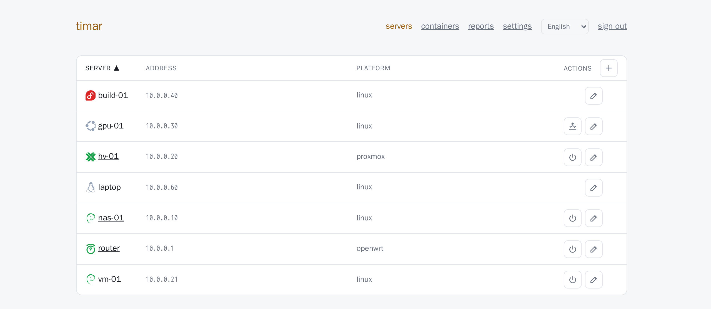
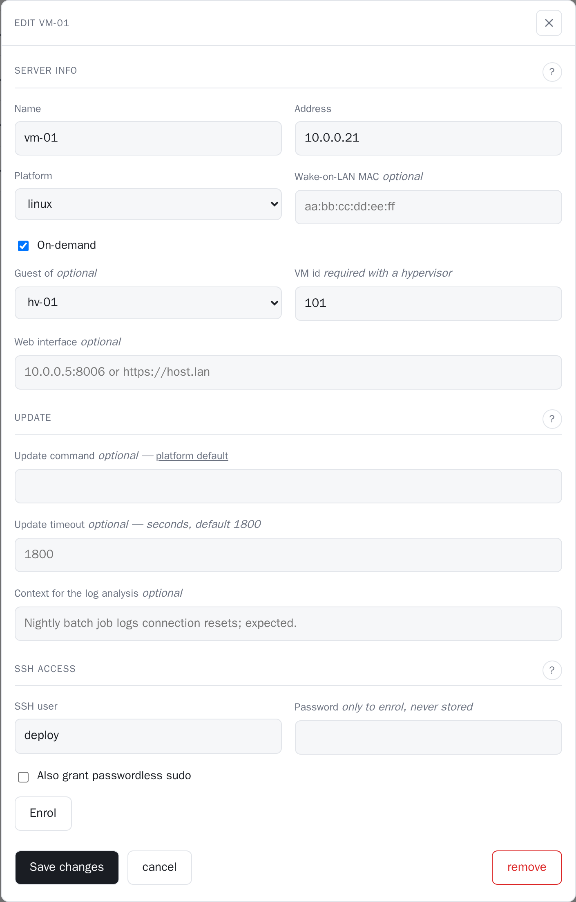
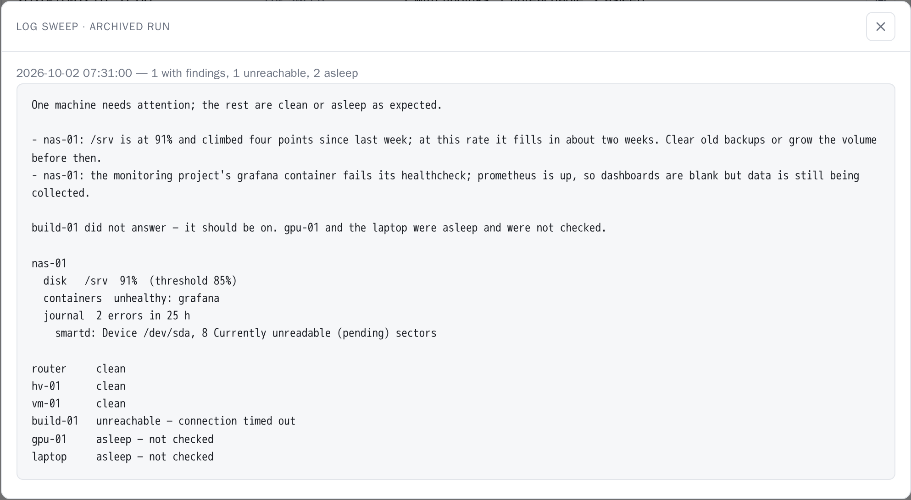

# Timar

[](https://github.com/orkun-soylu/timar/actions/workflows/tests.yml)
[](LICENSE)

Agentless fleet care for homelabs: wake machines that are asleep, update them, read their logs,
and put them back the way they were found.

Nothing is installed on the machines you manage — Timar needs SSH, and Wake-on-LAN for the ones
that sleep. It is one container with one data volume, so moving it is copying a directory.
There is a one-page tour at **[timar.tools](https://timar.tools)**.

<picture>
  <source media="(prefers-color-scheme: dark)" srcset="docs/images/dashboard-dark.png">
  
</picture>

Three states, not two. *Asleep* (grey) is a machine that is **meant** to be off, and it is not
painted like a fault — a status page that shows both in red teaches you to ignore red.

> **Status: early.** Wake, update, log sweep, the scheduler and key enrolment work and are
> tested. Read [CHANGELOG.md](CHANGELOG.md) before upgrading.

## Run it

```bash
curl -O https://raw.githubusercontent.com/orkun-soylu/timar/main/docker-compose.yml
docker compose up -d
```

Open `http://<host>:8080` and create the operator account — nothing else answers until you do.

The image is built for **amd64 and arm64**; a Raspberry Pi is a first-class host. `:latest`
follows the newest release; pin a version (`ghcr.io/orkun-soylu/timar:0.1.13`) to choose when
you move.

Add, edit, enrol and remove servers from the dashboard. It all lands in `config.yaml` in the
`timar-data` volume, which you can also edit by hand — see
[`config.example.yaml`](config.example.yaml).

<picture>
  <source media="(prefers-color-scheme: dark)" srcset="docs/images/server-dialog-dark.png">
  
</picture>

A VM has no wake address of its own, so it names the hypervisor that starts it and inherits
*on-demand* from it — otherwise every night it spends off would be reported as an outage.

> ⚠️ **Do not expose this to the internet.** Timar holds an SSH key that reaches every machine
> it manages and can grant itself `sudo` on them. Keep it on a private network, or behind a
> reverse proxy you control.

### Bridge networks and other subnets

The compose file uses `network_mode: host` because **Wake-on-LAN does not work from a bridge
network**: the send succeeds, no error, and the packet never reaches the LAN (measured with
`tcpdump`: bridge 0 packets, host 1).

If you do not need to wake machines, a bridge is fine — replace `network_mode: host` with:

```yaml
    ports:
      - "8080:8080"
```

To wake from a bridge — or to wake a machine in a **different subnet**, which host networking
cannot do either — give that server a **wake relay**: another enrolled, always-on host that
sends the packet over SSH. It needs `python3` or `wakeonlan`.

## Why

Homelab machines are mostly *off*. Tools built for always-on fleets assume an agent that phones
home — the one thing a sleeping machine cannot do. Timar inverts it: waking the host is the
first step of the job, and shutting it back down is the last.

## What it does

- **Update** — wake if asleep, run the platform's update command, shut down again if it started
  off. Proxmox hosts bring their guests along, in order.
- **Power** — wake an on-demand machine or shut it down from its row. Guests go through their
  hypervisor with `qm`. Always-on machines get no power button: Timar will not shut down what it
  cannot wake again.
- **Log sweep** — system log errors, disk pressure, stopped containers, and scheduled jobs that
  did not run.
- **Platform-aware** — Linux/systemd, OpenWrt and Proxmox VE each get commands that exist on
  them. A check that cannot run says so instead of reporting all-clear.
- **Report archive** — every finished run is kept under `/reports`, so a disk creeping upward or
  an update failing every week shows as a series. Telegram delivery is a copy, not the only one.

<picture>
  <source media="(prefers-color-scheme: dark)" srcset="docs/images/report-sweep-dark.png">
  
</picture>

The written assessment sits above the findings it came from, never instead of them. A machine
that was asleep is *not checked*, not clean — a sweep does not wake the fleet, and calling an
unchecked host healthy is the one thing a status page must not do.

## Supported platforms

| | System log | Disk | Containers | Unattended updates |
|---|---|---|---|---|
| Linux (systemd) | `journalctl` | ✅ | Docker | ✅ |
| Proxmox VE | `journalctl` | ✅ | — (guests via `qm`) | ✅ |
| OpenWrt | `logread` | ✅ | — | off by default |

OpenWrt has no default update command on purpose: an unattended `apk upgrade` can fill the
overlay or land a kernel-module mismatch on the machine carrying the SSH session you would
repair it from. Set `update_cmd` yourself if you want it.

## Development

```bash
python3 -m venv .venv && .venv/bin/pip install -e '.[dev]'
.venv/bin/python -m pytest
```

`TIMAR_DATA` is the whole installation, so point it somewhere disposable to run against a
throwaway copy instead of your real fleet:

```bash
TIMAR_DATA=/tmp/timar-dev TIMAR_PORT=8099 .venv/bin/python -m timar.web
```

## Contributing

Contributions are welcome — see [CONTRIBUTING.md](CONTRIBUTING.md). One habit up front: **for
anything that touches a machine, a network or a page, run it and put the measurement in the pull
request.** Timar's failures are quiet — a magic packet that never leaves the host, a disk check
that fails and reports all-clear — and a passing test does not always mean it works.

Commits are signed off under the [DCO](DCO) (`git commit -s`); there is no CLA. Design
decisions and their pitfalls are in [ARCHITECTURE.md](ARCHITECTURE.md).

## License

[MIT](LICENSE) © 2026 Orkun Soylu. Third-party components, including the vendored htmx, are
listed in [THIRD-PARTY-NOTICES.md](THIRD-PARTY-NOTICES.md).
